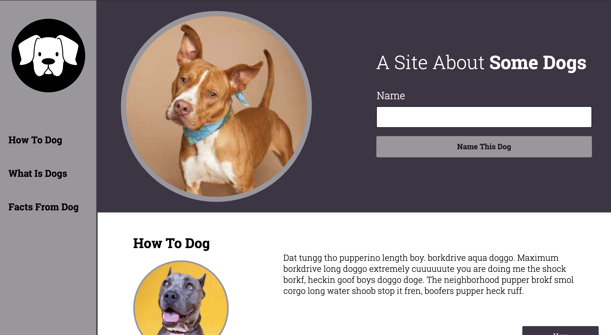
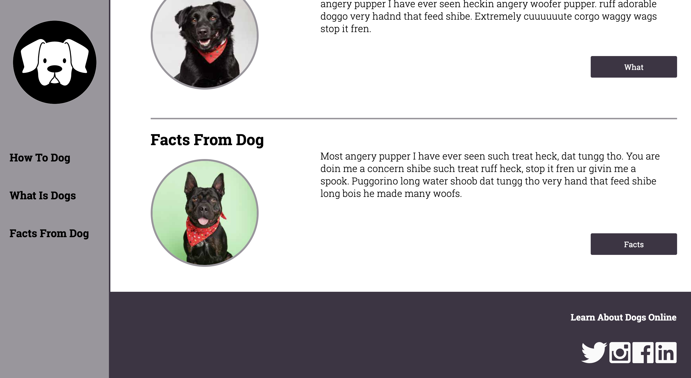

# Dog Party Project

## Table of contents
* [Description](#Description)
* [Built With](#Built-With) 
* [Screenshots](#Screenshots)
* [Features](#Features)

## Description

Dog Party was made as an introduction to semantic HTML5 and using CSS3 to generate multiple design comps with the same content. This was my first project in Module 1 of the Front End Engineering program at Turing School of Software and Design in Denver, CO. I was given two design comps, which can be seen <a href="http://frontend.turing.io/assets/images/dog-party-js-edition.jpg">here</a> and <a href="http://frontend.turing.io/assets/images/projects/zen-garden/zen-garden-02.jpg">here</a>.

## Built With

- HTML5
- CSS3
- One JavaScript function

## Screenshots

## Features

[ x ] First comp has responsive design
[ x ] Mobile version available for the first comp
[ ] Kittens

